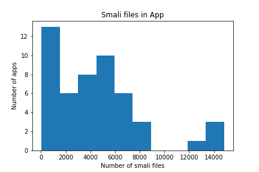
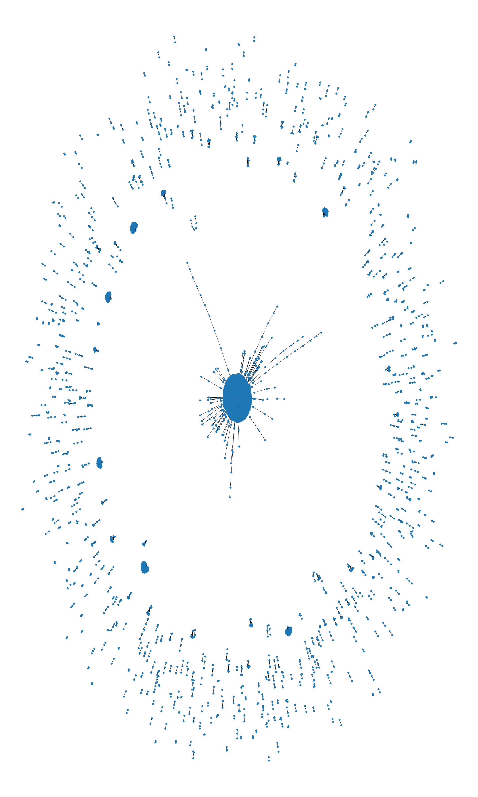
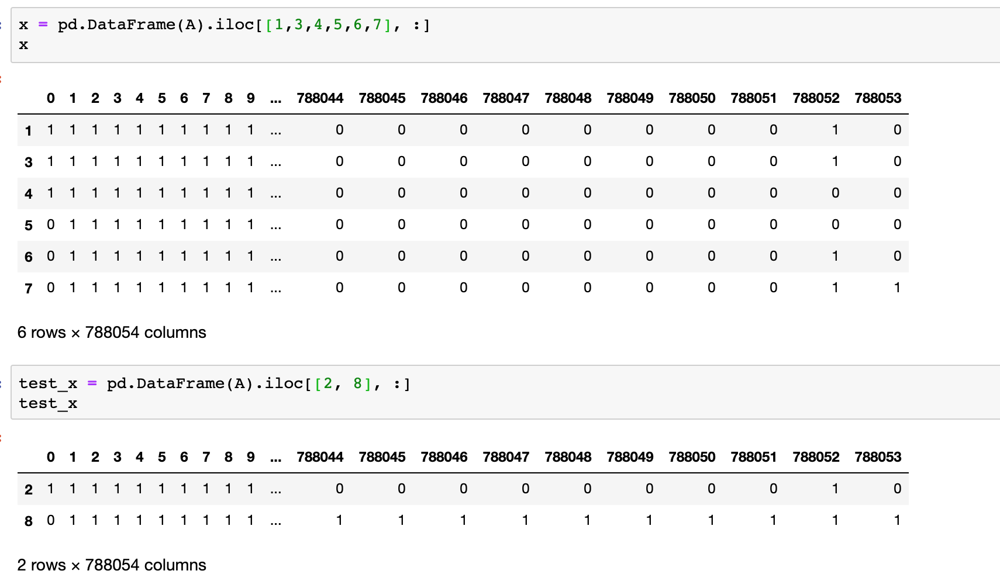
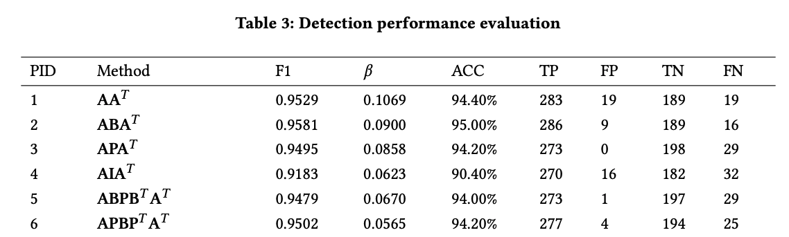

# Malware Detection Replication on Hindroid

Jeff Liao, zjliao@ucsd.edu, A13438127

## The Issue

### Introduction

Android phones make up about 74% of the whole smart phone market share [1]. With the abundance of Android phones on the market, malicious software, i.e. malware, can cause damages to the users. This is why malware dectection is needed to improve Android phones' security.

In this project replication, a technique to analyze whether an application is malware or not makes use of the application's Application Programming Interface (API) calls and their relationships with each other. These API call relationships are structured as a heterogeneous information network (HIN) [2]. This project tries to replicate HinDroid. HinDroid first decompiles Android APIs to smali code and then extracts API calls from the smali codes. It constructs matrixes that represents relationships between APKs and APIs and matrixes that represents relationships between APIs and APIs.

### The Data

The data that is used for analysis are each application's smali code. Each Android application is saved as a .apk file, which is similar to Window's .exe file or MacOS's .dmg file. Within the APK file, there exists a .dex Dalivik executable file, which is not human readable. In order to turn the dex formatted file into a readable format, APKTool is used to unzip the APK and decompile the Dalivik executable [2].

The data that will be used are:

1. Benign Android Application from apkpure.com that I will collect and decompile to smali Code.
2. Malware samples are provided as smali Code.

**Why is the data is appropriate to address the problem?**

- The resulting smali code that is generated using APKTool is the data that is being used to analysis. The data is valid because smali code is the "intermediate but interpreted code between Java and DalvikVM." This means that through the smali code we will be able to observe what an application is doing. From these observations, we will be able to create relationships and detect anomalies.

**What are the potential shortcomings of the data for addressing the problem?**

- There could be app type imbalance. Apps may be games or productivity tools and they could have different pattern sequences. For example, we could have games that do simple things such as flappy bird compared to a complex game that utilizes a lot of computing power such as Asphalt, a racing game.
- Bot created apps can be simple and in large numbers. This can create an issue because it can bias the whole training dataset with similar code patterns, and render the analysis useless.
- How the apps are chosen can also be tricky. Do we want to randomly sample apps from a list? Do we want apps that has a similar representation of the apps that most people download? Do we want to sample apps by size, rating, or number of downloads?

**What data have been used to address this problem in the past?[2]**

- **Dynamic analysis**
-- DroidDolphin: recorded activity features
-- Crowdroid: extracted API system calls
-- CopperDroid: extracted operating system interations and inter/intra-proc
- **Static analysis**
-- DroidMat: API calls, permissions, and intent messages
-- DroidMiner: API calls

**How data is analysed**
After extracting out the API calls, we make three relationship graphs.

1. APIs that co-exists in the same code block
2. APIs with the same package name
3. APIs that have the same invoke method
Each API call is saved as a node, and each relationship is saved as an edge.
From these reltionships, we can create a matrix. The values will be our features, and we can train out model using the matrix.

## Data Ingestion

**Where does the data come from?**
The data that we will be using is smali code from various Android apps. The apps' APK are downloaded from apkpure.com, and the smali code is generated using APKTool to disassemble the APK file. Then the all the smali files' directory are saved using python.

- Use two libraries, requests and BeautifulSoup, in Python to get access to the apkpure sitemap.
- Scrape all the links for an app. These links download the app's xml.
- Use python to go into the different sites for the apps mentioned in each of their xml and download the app's APK
- Use APKTool to decompile the APK
- For the first stage of this project's development, randomly shuffle apps.
- Iterate until *size* apps have been converted into smali code
-- For each link, download the app and use APKTool to convert the app into smali code.

**Note:** some APK's xml file cannot find the app's website, so I used a try except statement to deal with the error that might happen.

**Is this legal?**
The purpose of this project is to analyze whether an app is malicious or not. This purpose tries to help people protect their devices. I believe that this is an ethical and meaningful mission. In addition, this mission is similar to that of APKTool's: "It is NOT intended for piracy and other non-legal uses. It could be used for localizing, adding some features or support for custom platforms, analyzing applications and much more." 

**Are there any privacy issues?"**
There doesn't seem to have any privacy issues because we are mainly just reverse engineering the apps. The apks themselves do not contain personal information. Additionally, API calls are avaliable online, so our data will not intrude on privacy.

**Storage considerations and directory layout**

- Downloaded xml.gz files are saved in ./xml
- Downloaded apk are saved in ./apk
- Downloaded smali files are saved in ./data
- Malware is stored in DSMLP at "/datasets/dsc180a-wi20-public/Malware/amd_data_smali"

**Configuration files**  
___-params.json  
{  
    &nbsp;&nbsp;&nbsp;&nbsp;&nbsp;&nbsp;&nbsp;&nbsp;"benign_src": "/datasets/home/44/544/zjliao/dsc180a/data/smali",  
    &nbsp;&nbsp;&nbsp;&nbsp;&nbsp;&nbsp;&nbsp;&nbsp;"mal_src": "/datasets/dsc180a-wi20-public/Malware/amd_data_smali",  
    &nbsp;&nbsp;&nbsp;&nbsp;&nbsp;&nbsp;&nbsp;&nbsp;"num_b": X,  
    &nbsp;&nbsp;&nbsp;&nbsp;&nbsp;&nbsp;&nbsp;&nbsp;"num_m": Y  
}  
env.json  
{  
    &nbsp;&nbsp;&nbsp;&nbsp;&nbsp;&nbsp;&nbsp;&nbsp;"docker-image": "",  
    &nbsp;&nbsp;&nbsp;&nbsp;&nbsp;&nbsp;&nbsp;&nbsp;"output-paths": "/datasets/home/44/544/zjliao/dsc180a/"  
}

## EDA on Apps and Inital Small Scale Classification Trial

Currently, I have 50 apps downloaded and converted into smali code. Of these 50 apps, there are a total of 60503 unique APIs.

For 50 apps, there are 4404 smali files per app on average, and 75% of the apps have below 6061 smali files per app.  

With an inital look at the counts of APIS for one app, the API with the most count is "java/lang/Object;->\<init>()V," which has 5242 appearances. The most common class is "java/lang/Object" which has 6403 appearances. This is a valid observation because as the official Java documentation states, "every class has Object as a superclass."

Here we take a look at how an app looks like. The nodes in the image below are classes. The edges are relationships between a class and its superclass.

From this descriptive image, we can see that there is a class that has a ton of connections, and this would be the Object class.

For the classification trial stage, I used only a total dataset of 9 apps, 5 benign and 4 malware. The small dataset is mostly for testing whether the code works properly. 1 benign and 1 malware was held out as the test set. This inital trial also only constructed to A graph and used SVM from sklearn. One interesting characteristic of from the dataset was that the first column was all 1 for the benign apps and 0 for malware apps.

Because of the small dataset and the seemingly interesting column feature, the SVM without and parameter tunings got an 100% accuracy. Though this measurement may not mean much, but it will be interesting to see how the features will turn out to be when the dataset is scaled up.

## HinDroid's Approach

HinDroid creates metapaths as custom kernels to feed into SVM classifiers. Four matricies are made, A, B, P, and I. The A matrix tells us what APIs are called for each APK. So its rows are APKs and its columns are APIs. The B matrix are whether different APIs were called in the same block. The P matrix are whether different APIs are in the same package. The I matrix are whether different APIs have the same invokation method. B, P, and I all have APIs as rows and columns.  

HinDroid then uses these matrices to build a metapath. For example, AAT, ABAT,APAT.

### Graphs

In this project, we will analyze the smali code using a heterogeneous information network (HIN). HIN is a graph that has an entity type mapping and a relation type. An app is connected with another app if they share similar relations. For example, we have app1 and app2. Each app has its own APIs. We have another matrix that specifies relationships between APIs. Through this relational matrix, we can link the two applications.

There are 4 types of graphs that are constructed.

**Graph A**: This graph documents which APIs are connected to which AOKs. So we have columns of APIs and rows of APKs.  

*How to Construct:*  
We need three things to help us construct a complete adjacency matrix for A. We cannot directly call the adjacency_matrix function from networkx because we want APK x API, but the function will return (APK + API) x (APK + API). So, to get around this, we need a series for APK and a series for API. We will also need a dictionary to store the relationship between each APK and API.  

- Get a series of unique APKs. A series gives us a perfect mapping because the index is unique.
- Get a series of unique APIs. This series also gives us a perfect mapping.
- Get a dictionary of relationships. This dictionary looks like: {APK1: [APIs], APK2: [APIs], ...}
- Creating the adjacency matrix is the tricky part. To create the matrix, create a 2D list and use numpy to transform the 2D list to a matrix.

**Graph B**: This graph connects APIs together if they are within the same code block. A code block in the smali code are code that are in between ".method" and ".end method."

*How to Construct:*  

- Create a networkx graph
- For each samli file, locate code blocks
- For each code block find the APIs that are in them
- Create a dictionary that keeps track of the relationships. e.g. {block1: \[APIs]}
- Using this relationship dictionary, add edges into the graph mentioned above

**Graph I**: Each API has an invokation method. There are a total of 5 different invokation methods [2]:  

1. invoke-static: invokes a static method with parameters
2. invoke-virtual: invokes a virtual method with parameters
3. invoke-direct: invokes a method with parameters without the virtual method resolution
4. invoke-super: invokes the virtual method of the immediate parent class  
5. invoke-interface: invokes an interface method

*How to Construct:*  

- Create a networkx graph
- For each samli file, locate API calls
- For each API call, extract the invokation method
- Create a dictionary that keeps track of the relationships. {method: \[APIs]}
- Using this relationship dictionary, add edges into the graph mentioned above

**Graph P**: This graph connects APIs together if they have the same package.
For example, 

*How to Construct:*  

- Create a networkx graph
- For each samli file, locate API calls
- For each API call, extract the package
- Create a dictionary that keeps track of the relationships. {package: \[APIs]}
- Using this relationship dictionary, add edges into the graph mentioned above

### Replication

 [2]
The above table is a few results obtained by HinDroid's various metapaths.  
For this replication, I will test my results using the different kernels: AAT,  ABAT, APAT, APBPTAT. The accuracy for HinDroid is 94.4%, 95%, 94.2%, 94.2% respectively.  
In my replication, I also created the same matrices and used sklearn's SVM to make predictions. I ran my model from scratch two times to see whether the results were consistant. For each test, I had X amount of benign apps and X amount of malware. Out of these, 80% were training data and 30% were test data. For the first test, my total dataset contains 100 benign apps and 100 malware. The second test contained a total of 250 benign apps and 250 malware. The results I got are shown in the table below.

|        | Accuracy  |           |
|--------|-----------|-----------|
| Method | 1st trail | 2nd trail |
| AAT     | 95%       | 94%       |
| ABAT    | 66.66%    | 91.3%     |
| APAT    | 90%       | 92%       |
| APBPTAT  | 66.66%    | 89.33%    |

When running the 1st trial the total amount of unique APIs was around 1 million. When running the 2nd trial, there was 1.7 million unique APIs. Because of such a large number of APIs, it took around 9 hours for the 2nd trial to finish constructing the different matrices and train the SVM model.

## Conclusion

## Reference

- [1] [OS marketshare](https://gs.statcounter.com/os-market-share/mobile/worldwide)
- [2] [HinDroid](https://www.cse.ust.hk/~yqsong/papers/2017-KDD-HINDROID.pdf)
